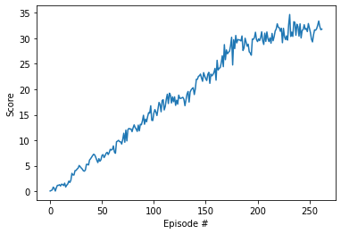

# Deep Reinforcement Learning Project

## Author

[Wiem Khlifi](https://github.com/WiemKhlifi/deep-reinforcement-learning/tree/master/p2_continuous-control)

## Project Overview

The primary objective of this project is to investigate the practical application of the Deep Deterministic Policy Gradient (DDPG) algorithm within the domain of Reinforcement Learning (RL). Specifically, our focus centers on utilizing DDPG to acquire an optimal policy for overseeing the actions of 20 agents within the Reacher Unity environment. This environment is characterized by a continuous state space, tasking the agents with manipulating their arm to reach a dynamically moving target. The agents operate within a continuous action space defined by four dimensions, representing the torque applied to the arm's two joints.

DDPG, a recognized actor-critic method in RL, has proven its efficacy in addressing complex control problems. By employing two neural networks – one dedicated to the actor and another to the critic – DDPG excels in learning a continuous policy from unprocessed sensory inputs. This project aims to showcase the prowess of DDPG in acquiring a suitable policy within the Reacher Unity environment.

This report offers a comprehensive overview of the DDPG implementation in the Reacher Unity environment, encompassing intricate details of the algorithm's design and architecture. Additionally, the report engages in a thorough discussion of the achieved results. The conclusion extends to reflections on the strengths and limitations of the employed method, accompanied by thoughtful suggestions for prospective avenues of research and improvement.

## Project Structure

The project report is divided into four parts:

- **Implementation**
- **Results**
- **Hyperparameters**
- **Ideas for improvement**

## Implementation

In the initial stages of training with a single agent, DDPG exhibited suboptimal results due to challenges related to instability and non-convergence. This can be attributed to the high sensitivity of the learning process to hyperparameters, making it difficult to identify an optimal parameter set for consistent and favorable outcomes.

However, the performance of DDPG showed significant enhancement when trained concurrently with multiple agents. Notably, employing 20 agents led to improved convergence and stability in the learning process. Several factors contributed to this improvement, including the augmented exploration capabilities facilitated by multiple agents and the capacity to assimilate knowledge from the experiences of other agents.

Apart from adjusting the number of agents, optimization measures were implemented on the neural networks. This involved increasing the number of neurons in each hidden layer, experimenting with the inclusion and removal of dropout layers, incorporating batch normalization, and concatenating the state-action pairs in the hidden layers of the critic model to prevent information loss during the forward pass. The buffer size emerged as a crucial factor influencing convergence, and it was observed that the learning rate of the critic needed to surpass that of the actor to achieve convergence.

To further enhance exploration in the state space and prevent the agent from settling into suboptimal policies, the Ornstein-Uhlenbeck process was introduced. This process introduced slight noise to the selected action at each time step.

Model fitting posed a challenge due to extended training times, making it difficult to discern convergence in the early iterations of the training process.

### Hyperparameters

The experiment encompassed numerous hyperparameters, and the specific values for each are detailed below:

| Hyperparameter                      | Value |
| ----------------------------------- | ----- |
| Replay buffer size                  | 1e6   |
| Batch size                          | 256   |
| $\gamma$ (discount factor)          | 0.99  |
| $\tau$                              | 1e-3  |
| Learning rate actor                 | 1e-4  |
| Learning rate critic                | 1e-3  |
| Number of episodes                  | 1000  |
| Max number of timesteps per episode | 1000  |
| Activation function                 | relu  |
| Hidden layers actor                 |   2   |
| Hidden layers units actor           |  256  |
| Hidden layers units actor           |  128  |
| Hidden layers critic                |   3   |
| Hidden layers units critic          |  512  |
| Hidden layers units critic          |  256  |
| Hidden layers units critic          |  128  |

## Results

The environment was solved in **163 episodes** with an **Average Score: 30.07**.

## Ideas for Improvement

* **Hyperparameter Tuning**:
The effectiveness of the DDPG algorithm is notably influenced by the values assigned to its hyperparameters. Conducting systematic experiments with diverse hyperparameter values, including parameters like learning rate, discount factor, and noise parameters, is crucial for identifying optimal configurations tailored to the Reacher environment with 20 agents. Such fine-tuning endeavors contribute to refining the algorithm's performance in the given context.

* **Prioritized Experience Replay**:
Introducing a mechanism akin to the DQN algorithm, the DDPG algorithm stands to gain from prioritized experience replay. Prioritizing experiences based on their significance for learning can enhance the agent's efficiency and overall performance. This prioritization can involve assigning higher importance to experiences with a higher TD error or utilizing other metrics indicative of their relevance.
