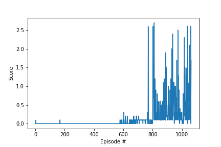

Author: [Wiem Khlifi](https://github.com/WiemKhlifi/deep-reinforcement-learning/tree/master/p3_collab-complet) 

The primary goal of this project is to investigate the practical application of the Multi-Agent Deep Deterministic Policy Gradient (MADDPG) algorithm within the domain of Reinforcement Learning (RL). Specifically, the focus is directed towards leveraging MADDPG to acquire an optimal policy for steering two agents in the Tennis Unity environment. Within this environment, characterized by a continuous state space, the agents are tasked with manipulating their rackets to engage in a back-and-forth interaction with a moving ball. The agents' action space is continuous and comprises two dimensions, representing movement towards or away from the net and the option to jump or remain stationary.

MADDPG, an extension of the DDPG algorithm tailored for multi-agent systems, operates by having each agent learn a local policy interacting with its environment while considering the policies of other agents. The utilization of two neural networks, one dedicated to the actor and another to the critic, empowers MADDPG to learn a continuous policy from unprocessed sensory inputs for each agent. The overarching aim of this project is to showcase MADDPG's capability to acquire a proficient policy within the Tennis Unity environment.

This report offers a comprehensive overview of the MADDPG implementation in the Tennis Unity environment. It delves into intricate details regarding the algorithm's design and architecture and provides a thorough discussion of the obtained results. The report culminates with reflections on the method's strengths and limitations, accompanied by insightful suggestions for future avenues of work.

## Project Structure

The project report is divided into four parts:

- **Implementation details**
- **Results**
- **Hyperparameters**
- **Ideas for improvement**

## Implementation details

The Tennis Unity environment shares similarities with the 20-agent Reacher Unity environment, featuring a continuous state space and requiring agents to learn a policy for manipulating their rackets to strike a ball over a net. Analogous to the Reacher environment, Tennis poses a continuous control challenge, with agents navigating a continuous action space defining racket movement across two dimensions.

Within the Tennis environment, two agents engage in gameplay, aiming to sustain ball interaction for as long as possible. The reward structure awards each agent a +0.1 reward for successfully hitting the ball over the net and imposes a -0.01 penalty if the ball hits the ground or goes out of bounds. Consequently, the success of one agent intertwines not only with its own actions but also with those of its opponent. If an agent successfully hits the ball over the net but its opponent fails to return it, the former receives a reward of +0.1, and vice versa. This interdependence underscores that the achievement of a single agent is intricately tied to the collaborative efforts of both agents in maintaining the ball in play.

Given this cooperative dynamic, the Multi-Agent Deep Deterministic Policy Gradient (MADDPG) algorithm, designed explicitly for training multiple agents in cooperative settings, emerges as a natural choice for the Tennis environment. MADDPG adopts a centralized critic and decentralized actor approach to learning. Each agent formulates its policy based on individual observations, while the critic learns a centralized value function, taking into account the actions of all agents. This collaborative learning approach fosters more effective and efficient learning among the agents.

In the initial implementation of the DDPG algorithm on the Tennis environment, the Ornstein-Uhlenbeck (OU) process was initially employed to introduce noise in action space exploration. However, the OU process proved inefficient in promoting convergence, leading to the algorithm getting trapped in local optima. Consequently, the OU process was replaced with the introduction of dropout in the actor model. Dropout, a regularization technique, involves randomly dropping out neurons during training, preventing overfitting and introducing noise in the output. This modification enabled the DDPG algorithm to explore the action space more effectively, achieving improved convergence.

In this implementation, both the state and action are incorporated into all hidden layers of the critic model, facilitating a more accurate capture of complex nonlinear relationships between state and action. This adjustment contributed to enhanced convergence and performance in the Tennis Unity environment.

  ### Hyperparameters

  Numerous hyperparameters were integral to the experiment, and the specific values assigned to each are detailed below:

  | Hyperparameter                      | Value |
  | ----------------------------------- | ----- |
  | Replay buffer size                  | 1e6   |
  | Batch size                          | 128   |
  | $\gamma$ (discount factor)          | 0.99  |
  | $\tau$                              | 1e-3  |
  | Learning rate actor                 | 1e-4  |
  | Learning rate critic                | 1e-3  |
  | Number of episodes                  | 5000  |
  | Max number of timesteps per episode | 1000  |
  | Activation function                 | relu  |
  | Hidden layers actor                 |   2   |
  | Hidden layers units actor           |  256  |
  | Dropout layer actor                 |  0.2  |
  | Hidden layers units actor           |  128  |
  | Hidden layers critic                |   3   |
  | Hidden layers units critic          |  512  |
  | Hidden layers units critic          |  256  |
  | Batch normalisation layer 2 critic  |  True |
  | Hidden layers units critic          |  128  |

 ### Results
The environment was solved in **964 episodes** with an **Average Score: 0.501**.

### Ideas for improvement

* **Prioritized Experience Replay:**
  Introducing a mechanism similar to the DQN algorithm, the DDPG algorithm stands to benefit from prioritized experience replay. The prioritization of experiences based on their significance for learning can enhance efficiency and overall performance. This prioritization can involve assigning higher importance to experiences with a higher TD error or utilizing other metrics indicative of their relevance.

* **Hyperparameter Tuning:**
  Acknowledge that the performance of the DDPG algorithm is closely tied to the values assigned to its hyperparameters. Conducting systematic experiments with varying values for hyperparameters, including but not limited to learning rate, discount factor, and noise parameters, is imperative. This experimentation aids in identifying optimal configurations for enhancing the DDPG algorithm's performance.

* **Use of Another Algorithm:**
  Consider exploring alternative algorithms, such as the Multi-Agent Actor-Critic with Communication (MAAC) algorithm. MAAC extends the traditional actor-critic method by implementing a communication mechanism between agents. This communication is facilitated through a centralized critic network that takes the joint state and action of all agents as input and outputs the state-action value function. Agents leverage this information to update their individual policies.